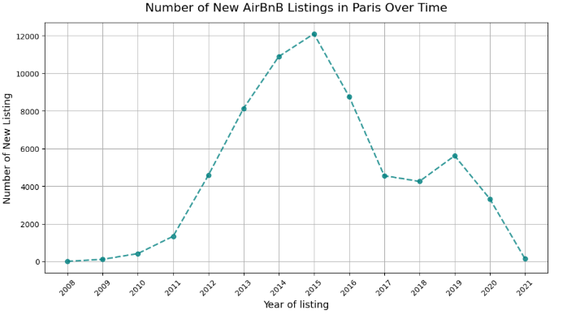

(""
# 🏠 Airbnb Paris Analysis


This project explores the **Airbnb rental landscape in Paris**, analyzing listing prices, availability, host behavior, and regulatory impact using **Python and Jupyter Notebook**.

The goal is to understand:

- How pricing varies across **neighborhoods and property types**
- Which hosts dominate the market — **individuals vs. commercial operators**
- The **effect of regulations** on Airbnb business activity in Paris

---

## 📌 Objectives

* Understand Airbnb supply trends in Paris (2008–2021).
* Analyze the impact of the **2017 rental regulations** on host participation.
* Explore **locality-wise pricing patterns** and affordability.
* Study the relationship between **accommodation capacity** and average price.
* Provide **business insights & recommendations** for stakeholders.

---

## 📊 Key Insights

* **Rapid Growth (2008–2016):** Strong host entry and expansion of listings.
* **Regulatory Shift (2017):** Significant slowdown in new hosts entering the market.
* **Resilient Demand:** Despite fewer new listings, customer demand stayed stable.
* **Pricing Trends:** Competition lowered prices pre-2017, but post-regulation supply constraints pushed prices upward.
* **Locality Insights:** Central Paris commands premium prices, while outer neighborhoods attract budget travelers.

---

## 🚀 Recommendations

* Focus on **premium central areas** while maintaining offerings in budget-friendly neighborhoods.
* Implement **dynamic pricing** to balance supply-demand fluctuations.
* Diversify listings, especially targeting **medium-capacity stays (3–6 guests)**.
* Strengthen **customer experience** with quality listings and repeat-stay strategies.
* Stay compliant and adapt to evolving **local regulations** for long-term sustainability.

---

## 🛠️ Tech Stack

* **Python** (pandas, numpy) – Data cleaning & processing
* **Matplotlib / Seaborn** – Data visualization
* **Jupyter Notebook** – Interactive analysis

---

## 📂 Project Structure

```
├── data/                  # Raw & cleaned datasets
├── notebooks/             # Jupyter notebooks
├── images/                # Visualizations exported from notebooks
├── requirements.txt       # Dependencies
├── LICENSE                # License file (MIT)
├── README.md              # Project overview (this file)
```

---

## ⚙️ How to Run

1. Clone this repository

   ```bash
   git clone https://github.com/your-username/airbnb-paris-analysis.git
   cd airbnb-paris-analysis
   ```

2. Install dependencies

   ```bash
   pip install -r requirements.txt
   ```

3. Launch Jupyter Notebook

   ```bash
   jupyter notebook
   ```

4. Open `airbnb-paris-analysis.ipynb` and run the cells step by step.

---

## 📊 Results

Here are some key visualizations from the analysis:

* **Growth of Airbnb Listings in Paris**
  

* **Average Price by Locality**
  

* **Impact of 2017 Regulation on Host Entries**
  

---

## 📜 License

This project is licensed under the MIT License - see the [LICENSE](LICENSE) file for details.

---

## 🙌 Acknowledgments

* [Inside Airbnb](http://insideairbnb.com/) for providing the dataset.
* Paris regulatory context from local housing policies.

---

## 🚀 Future Work

* Extend the analysis to other European cities for comparison.
* Add predictive modeling to forecast Airbnb prices.
* Build an interactive dashboard with Plotly or Power BI.

---

✅ **Final Note:**
This project highlights the intersection of **data, policy, and business strategy** in the short-term rental market.
Paris remains a dynamic case study of how regulations reshape supply, demand, and pricing in urban tourism.
